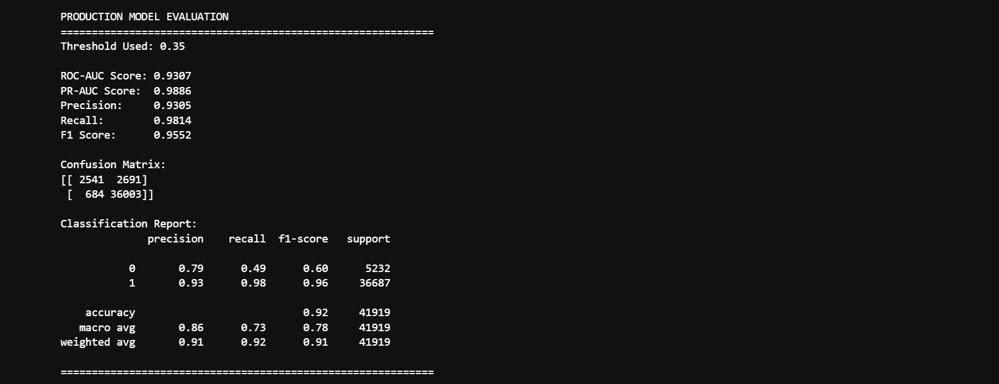

# Micro-Credit Loan Default Prediction Pipeline

## Problem Statement
The goal of this project is to build a production-grade machine learning classification pipeline to predict if a user will default on a micro-credit loan. Moving beyond basic exploratory analysis, this project emphasizes strict MLOps and software engineering principles: aggressively eliminating data leakage, safely handling missing production data, embedding custom feature engineering directly into Scikit-Learn `Pipeline` objects, and utilizing custom decision thresholds to align model outputs directly with business risk objectives.

## Dataset Information
* **Source:** Telecommunications Micro-Credit Dataset 
* **Target Variable:** `label` (Binary Classification: 1 = Paid Back, 0 = Default)
* **Key Features:** Loan amounts (30/90 days), daily account deductions, cellular recharge frequencies, and network usage behavior.
  
## Tools & Technologies Used
* **Programming Language:** Python
* **Data Manipulation:** `pandas`, `numpy`
* **Machine Learning:** `scikit-learn` (Random Forest, cross_val_score, Pipeline, ColumnTransformer)
* **Explainable AI (XAI):** `feature_importances_` dynamically mapped via `get_feature_names_out()`
* **Evaluation Metrics:** ROC-AUC, PR-AUC, Precision, Recall, F1-Score

## Steps Performed
1. **Aggressive Data Leakage Prevention:** * Dropped highly specific identifiers (`msisdn`) to prevent model memorization.
   * **Crucial Step:** Purged direct historical payback features (`payback30`, `payback90`) that act as "future information" at the time of a loan application, ensuring the model relies purely on behavioral telecom data.
2. **Embedded Feature & Datetime Engineering:** * Formulated high-signal derived financial metrics: `AvgLoanAmount`, `TotalLoanCount`.
   * Engineered datetime markers (`isWeekend`, `pWeekday`) to capture behavioral spending shifts.
   * Packaged this custom logic into a Scikit-Learn `FunctionTransformer` for autonomous generation in production.
3. **Tree-Aware Preprocessing & Safety Nets:** * *Numerical:* Handled missing production data via `SimpleImputer(strategy='median')`. (Note: Scaling was intentionally bypassed to optimize performance for the tree-based Random Forest model).
   * *Categorical:* Imputed missing data with a constant and applied `OneHotEncoder` (with `handle_unknown='ignore'`).
4. **Cross-Validation & Model Training:** Validated model stability using 5-Fold Cross-Validation (`cross_val_score`) directly on the pipeline before finalizing the train/test split. Handled severe class imbalance using `class_weight="balanced"`.
5. **Threshold Tuning:** Lowered the prediction decision threshold to `0.35` to heavily prioritize identifying high-risk defaults over maintaining standard precision.

## Key Insights & Results
By eliminating highly correlated historical payback features, we pressure-tested the model to see if it could predict financial solvency based purely on cellular usage patterns. The **Random Forest Classifier** proved highly successful.

**Business Takeaways:**
* **Telecom Behavior = Financial Solvency:** Even without knowing a user's direct loan payback history, features like cellular recharge frequency and daily account deductions act as a massive proxy for predicting future default risk.
* **Optimizing for Financial Risk:** Standard accuracy is a dangerous metric in credit risk. By forcing the model to balance class weights and lowering the decision threshold to `0.35`, we shifted the algorithm's focus: it is mathematically cheaper for the business to double-check a false positive than it is to grant a loan to a missed default.
* **Production Readiness:** By wrapping custom math, imputation, categorical encoding, and classification into a single serialized `.pkl` artifact, the final model is fully autonomous and immune to crashes caused by missing data in real-time deployment.

## Screenshots & Visualizations

### 1. Top Drivers of Loan Default

*Feature Importance graph highlighting the top 15 behavioral factors driving the model's decisions, extracted dynamically from the `ColumnTransformer` pipeline.*

### 2. Target Class Imbalance

*Countplot illustrating the severe class imbalance between successful paybacks and defaults, necessitating the use of balanced class weights during training.*

### 3. Model Evaluation Matrix

*Confusion Matrix and Classification Report proving the effectiveness of the 0.35 decision threshold in capturing high-risk defaults (Recall).*
