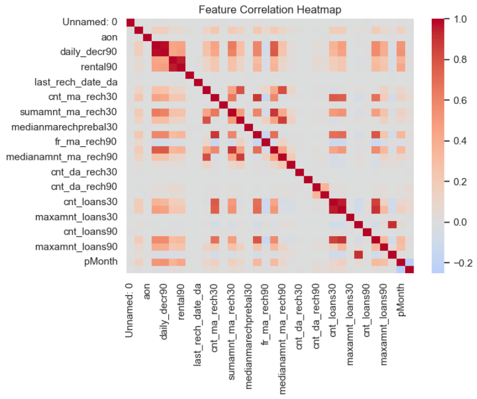
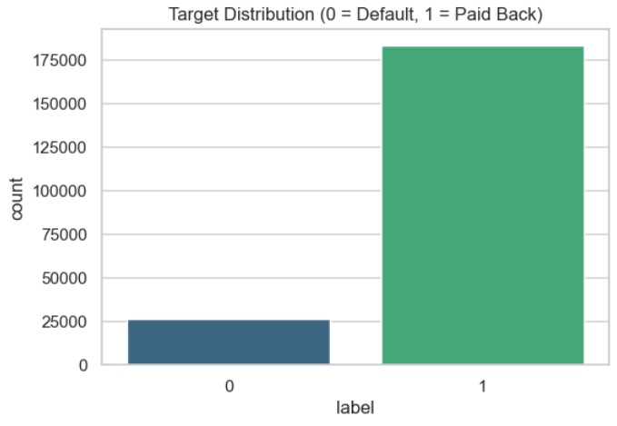

# Micro-Credit Loan Default Prediction Pipeline

## Problem Statement
The goal of this project is to build a production-grade machine learning classification pipeline to predict if a user will default on a micro-credit loan. Moving beyond basic exploratory analysis, this project emphasizes strict MLOps and software engineering principles: preventing data leakage, addressing severe class imbalance, safely handling missing production data, and embedding custom feature engineering directly into Scikit-Learn `Pipeline` objects.

## Dataset Information
* **Source:** Telecommunications Micro-Credit Dataset 
* **Target Variable:** `label` (Binary Classification: 1 = Paid Back, 0 = Default)
* **Key Features:** Loan amounts (30/90 days), daily account deductions, recharge frequencies, and historical payback behaviors.
  
## Tools & Technologies Used
* **Programming Language:** Python
* **Data Manipulation:** `pandas`, `numpy`
* **Machine Learning:** `scikit-learn` (Random Forest, HistGradientBoosting, Logistic Regression, RandomizedSearchCV)
* **Explainable AI (XAI):** `permutation_importance`
* **Data Visualization:** `matplotlib`, `seaborn`

## Steps Performed
1. **Data Leakage Prevention & ID Removal:** Dropped highly specific identifiers (`msisdn`) to prevent model memorization and executed a strict, stratified `train_test_split` prior to any processing.
2. **Embedded Feature Engineering:** * Formulated high-signal derived financial metrics: `LoanToPaybackRatio`, `LateRepayment` flags, and `AvgLoanAmount`.
   * Packaged this custom math into a Scikit-Learn `FunctionTransformer` so the pipeline automatically generates these features in production without manual intervention.
3. **Automated Preprocessing & Safety Nets:** Constructed a robust `ColumnTransformer` pipeline.
   * *Numerical:* Handled missing production data via `SimpleImputer(strategy='median')` and scaled features using `StandardScaler`.
   * *Categorical:* Imputed missing data with a constant and applied `OneHotEncoder` (with `handle_unknown='ignore'`).
4. **Model Bake-Off & Imbalance Handling:** Evaluated multiple baseline algorithms. Because defaults (0s) are much rarer than successful paybacks (1s), implemented `class_weight="balanced"` across all models to heavily penalize missed defaults. 

## Key Insights & Results
While HistGradientBoosting slightly edged out competitors in raw ROC-AUC, the **Random Forest Classifier** was selected as the final production model due to its superior **Recall** and **Log Loss** metrics. In the micro-credit business, missing a default is significantly more expensive than a false positive, making Random Forest the optimal business decision.

**Business Takeaways:**
* **Historical Repayment is King:** Features tracking a user's 30-day and 90-day loan-to-payback ratios are massive indicators of future default risk.
* **Class Imbalance Dictates Strategy:** Standard accuracy is a dangerous metric in credit risk. By forcing the model to balance class weights, we successfully shifted the algorithm's focus to catching high-risk users.
* **Production Readiness:** By wrapping feature engineering, imputation, and classification into a single serialized `.pkl` artifact, the final model is fully autonomous and immune to crashes caused by missing data in real-time deployment.

## 📸 Screenshots & Visualizations

### 1. Top Drivers of Loan Default

*Permutation Importance graph highlighting the top 15 features driving the model's decisions, proving that historical payback ratios and recharge frequencies lead the risk assessment.*

### 2. Target Class Imbalance

*Countplot illustrating the severe class imbalance between successful paybacks and defaults, necessitating the use of balanced class weights during training.*

### 3. Feature Correlation

*Heatmap analyzing the multicollinearity between numerical features like 30-day and 90-day loan amounts to guide feature selection.*
